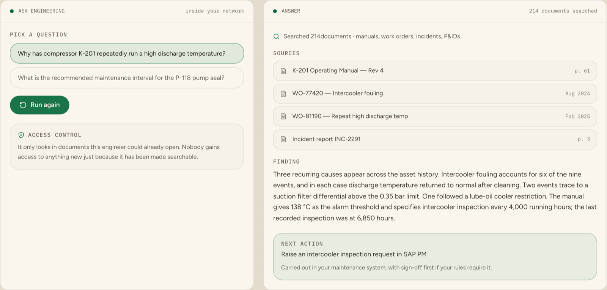

# Arabic Engineering AI Copilot

> Ask questions of decades of engineering manuals, drawings, work orders and incident reports — with every answer citing its source page.

Built for Saudi Arabia. Manuals, drawings, procedures, work orders and
incident reports — in Arabic, English or both — become something an engineer
can simply ask, and every answer shows the document and page it came from.
None of it leaves your network.

<p align="center">
  <a href="https://voho.ai/demos/engineering-ai">
    
  </a>
</p>

<p align="center">
  <b><a href="https://voho.ai/demos/engineering-ai">▶ Play the live demo</a></b> — runs in your browser, no sign-up.
</p>

<!-- voho:try -->
## Try it in your browser first

You do not have to clone anything to see whether this works for you. The same
engine this repository calls is running at **[app.voho.ai/engineering-ai](https://app.voho.ai/engineering-ai)** —
ask a manual a question, in the browser, in about a minute.

New accounts start with **$25 of credit**, and one balance and one API key
cover every Voho product: Engineering AI, and the five beside it.

- **[Ask a manual a question →](https://app.voho.ai/engineering-ai)**
- [Get an API key](https://app.voho.ai/tokens) — the key this repository needs
- [Read the API docs](https://docs.voho.ai)

Running it inside your own estate, against your own systems, is what we do
with you: [talk to us](https://voho.ai/book-demo).

---

---

## What this does

- Search across manuals, standard operating procedures, work orders, inspection reports and incident history at once.
- Cite the document and page every answer came from, so an engineer verifies before acting.
- Run entirely inside your own network, which is usually mandatory for engineering data in Saudi industry.

## Quick start

You need a Voho API key. Create one at [app.voho.ai](https://app.voho.ai) under **API Tokens**.

```bash
git clone https://github.com/yar-malik/arabic-engineering-ai-copilot.git
cd arabic-engineering-ai-copilot
cp .env.example .env      # then paste your key into .env
```

### Node.js

```bash
npm install
node examples/node/index.mjs
```

### Python

```bash
pip install -r requirements.txt
python examples/python/main.py
```

Both examples ask why a compressor keeps running a high discharge temperature and get a cited answer.

## Arabic voices

| Voice | Dialect | Gender | Notes |
| --- | --- | --- | --- |
| `layla` | **Najdi** | female | Warm Riyadh delivery. The default for reception and appointments. |
| `nouf` | **Najdi** | female | Measured and senior. Collections, escalations, compliance scripts. |
| `faisal` | **Najdi** | male | Even and authoritative. Reads long policy text well. |
| `omar` | **Najdi** | male | Bright and quick. Outbound offers and short confirmations. |
| `reem` | Gulf | female | Lighter Gulf accent, conversational. |
| `khalid` | Modern Standard | male | Broadcast register. Announcements and IVR trees. |
| `maha` | Egyptian | female | Unhurried and reassuring. |
| `yousef` | Modern Standard | male | Neutral. Safest when the caller's dialect is unknown. |


List them live:

```bash
curl "https://app.voho.ai/v1/voices?dialect=najdi" \
  -H "Authorization: Bearer $VOHO_API_KEY"
```

## Audio formats

| Format | Sample rate | Use it for |
| --- | --- | --- |
| `mulaw` | 8 kHz | **Telephony.** What Cisco, Avaya and SIP trunks carry. No transcoding. |
| `mp3` | 24 kHz | Files, playback, storage. |
| `wav` | 24 kHz | Editing and processing. |
| `opus` | 24 kHz | Streaming to a browser. Lowest time to first audio. |

## Streaming

For live calls, first-audio latency is what gets measured. Streaming returns
audio while the sentence is still being produced:

```bash
curl -N -X POST "https://app.voho.ai/v1/speech/stream" \
  -H "Authorization: Bearer $VOHO_API_KEY" \
  -H "Content-Type: application/json" \
  -d '{"text":"أهلاً بك","voice":"layla","format":"opus"}' --output out.ogg
```

A WebSocket endpoint at `wss://app.voho.ai/v1/speech/ws` accepts text
incrementally, so an LLM can stream tokens in while audio streams out.

## Running inside your own network

Saudi enterprises frequently require that data does not leave the building.
Every Voho product can run on your own servers, in a private section of your
cloud, or in a Saudi data centre — including with no internet connection at
all. Point `VOHO_BASE_URL` at your own deployment and nothing else changes.

## Security

- No key is committed here. `.env` is git-ignored; `.env.example` holds
  placeholders only.
- Rotate keys from the dashboard. Only a hash is stored server-side, so a
  leaked database does not hand anyone a working credential.
- Scope one key per environment.

## Other examples in this series

| Repository | What it covers | Live demo |
| --- | --- | --- |
| [saudi-arabic-voice-agent](https://github.com/yar-malik/saudi-arabic-voice-agent) | Phone agents in Najdi Arabic | [Play it](https://voho.ai/demos/ai-call-center) |
| [arabic-document-ai](https://github.com/yar-malik/arabic-document-ai) | Reading Saudi invoices, IDs and contracts | [Play it](https://voho.ai/demos/document-ai) |
| [arabic-voice-dictation-enterprise](https://github.com/yar-malik/arabic-voice-dictation-enterprise) | Speaking instead of typing | [Play it](https://voho.ai/demos/ai-voice-assistant) |
| [arabic-engineering-ai-copilot](https://github.com/yar-malik/arabic-engineering-ai-copilot) | Asking engineering archives | [Play it](https://voho.ai/demos/engineering-ai) |
| [saudi-enterprise-ai-agent-platform](https://github.com/yar-malik/saudi-enterprise-ai-agent-platform) | Agents that act in SAP and ServiceNow | [Play it](https://voho.ai/demos/private-enterprise-ai) |
| [archibus-sap-ai-orchestration](https://github.com/yar-malik/archibus-sap-ai-orchestration) | Facilities, Archibus, IoT | [Play it](https://voho.ai/demos/smart-buildings-cities) |

## Want this in production?

We build the first workflow with you, on your own systems — usually live
within a month.

**[Book a call →](https://voho.ai/book-demo)**

---

Topics: `saudi-arabia` `arabic` `oil-and-gas` `engineering` `rag` `knowledge-base` `maintenance` `sap-pm` `enterprise-ai` `industrial-ai`

MIT licensed. Built by [Voho](https://voho.ai) — enterprise AI for Saudi Arabia.
